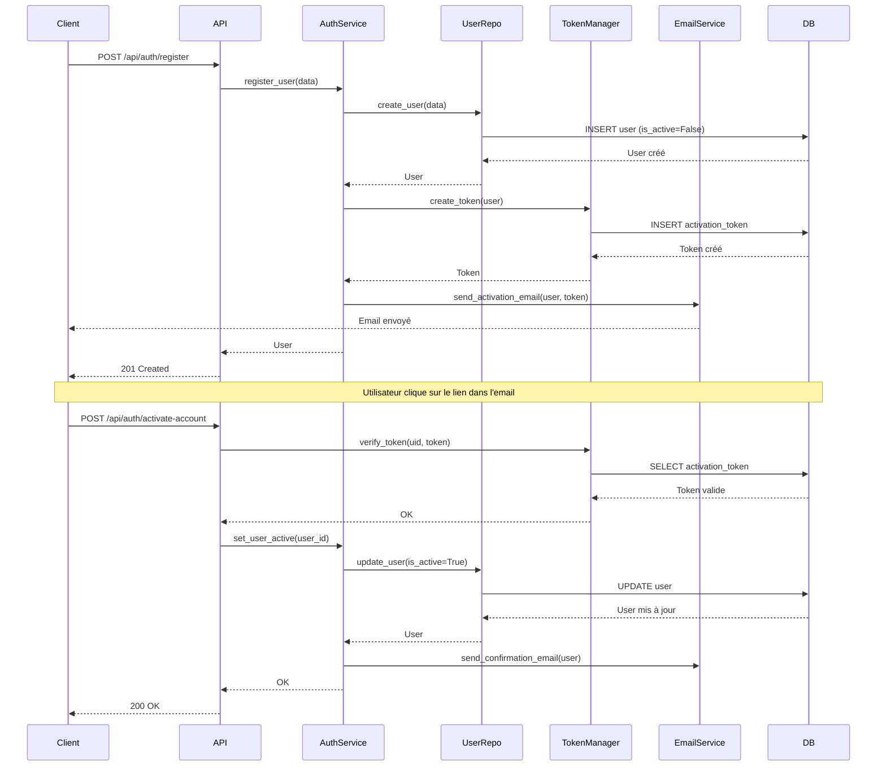
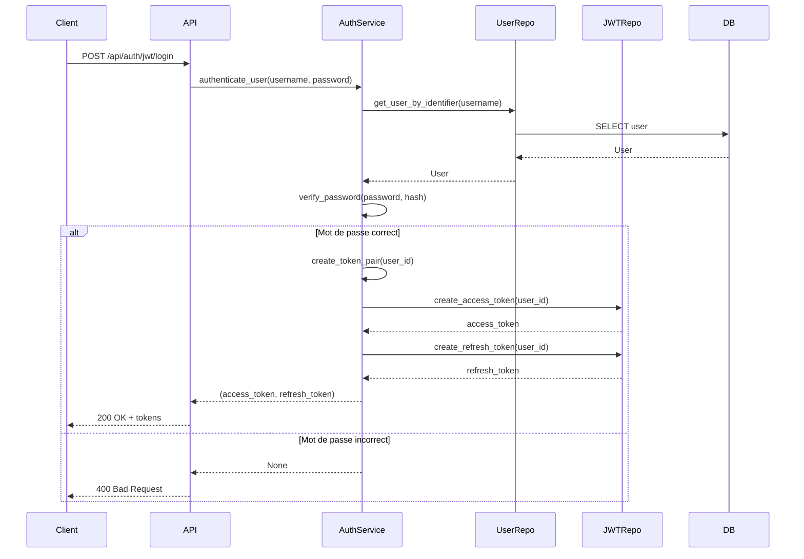
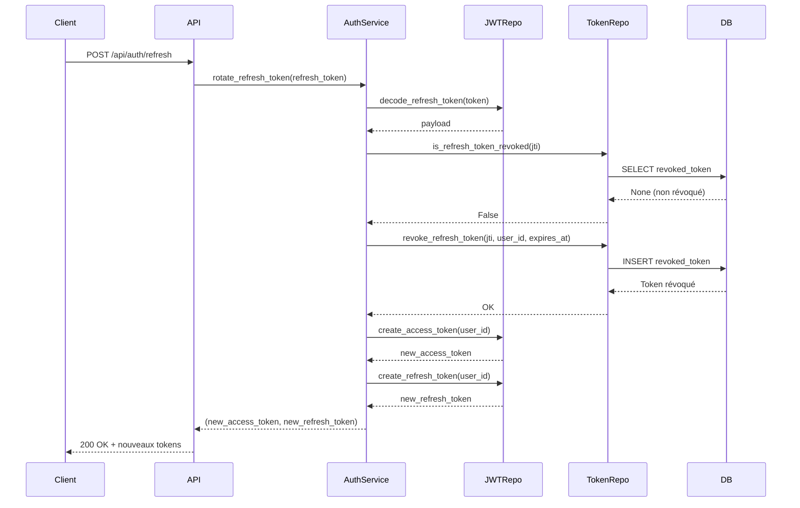
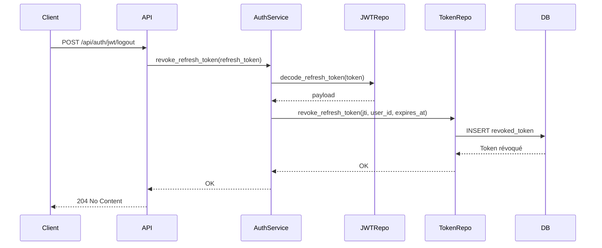
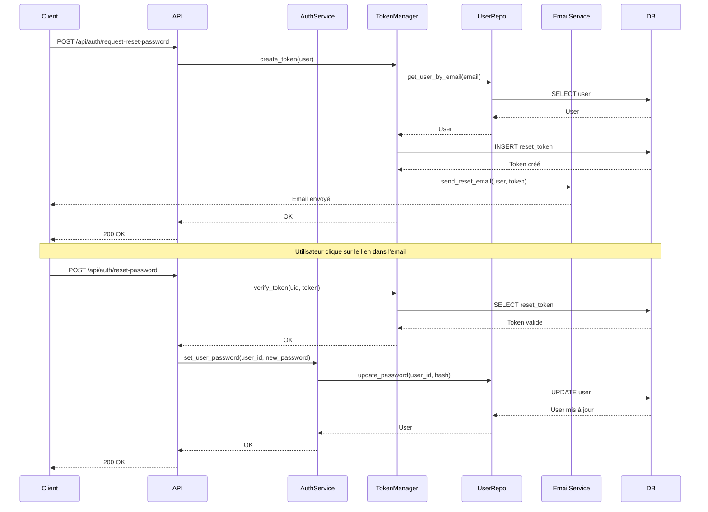

# Authentification

Ce document présente le système d'authentification complet du backend Shadow Role, incluant les tokens JWT, les endpoints, les workflows et la gestion des sessions.

## Vue d'ensemble

L'authentification dans Shadow Role utilise un système JWT avec deux types de tokens :

- **Access Token** : Token de courte durée (30 minutes) pour authentifier les requêtes API
- **Refresh Token** : Token de longue durée stocké dans une deny-list pour permettre la rotation

## Architecture

```
┌─────────────────────────────────────────┐
│         API Routes (FastAPI)            │
│  /auth/login, /auth/register, etc.      │
└──────────────┬──────────────────────────┘
               │
┌──────────────▼──────────────────────────┐
│    AuthenticationService                │
│  - Inscription                          │
│  - Authentification                     │
│  - Gestion des tokens                   │
└──────────────┬──────────────────────────┘
               │
    ┌──────────┴──────────┐
    │                     │
┌───▼──────────┐   ┌──────▼──────────┐
│ JWTRepository│   │ TokenRepository │
│ - Création   │   │ - Deny-list     │
│ - Validation │   │ - Révocation    │
└──────────────┘   └─────────────────┘
```

## JWT Tokens

### Structure des Tokens

#### Access Token

- **Durée de vie** : 30 minutes par défaut (configurable via `ACCESS_TOKEN_EXPIRE_MINUTES`)
- **Usage** : Authentification des requêtes API
- **Stockage** : Côté client (localStorage)
- **Type** : `"access"` dans le payload

**Payload** :

```json
{
  "sub": "user-uuid",
  "iat": 1234567890,
  "type": "access",
  "exp": 1234567890,
  "jti": "unique-token-id"
}
```

#### Refresh Token

- **Durée de vie** : Longue (configurable via `REFRESH_TOKEN_EXPIRE_MINUTES`)
- **Usage** : Obtenir un nouveau couple de tokens
- **Stockage** : Côté client + deny-list côté serveur
- **Type** : `"refresh"` dans le payload

**Payload** :

```json
{
  "sub": "user-uuid",
  "iat": 1234567890,
  "type": "refresh",
  "exp": 1234567890,
  "jti": "unique-token-id"
}
```

**Champs** :

- `sub` : Subject (ID de l'utilisateur)
- `iat` : Issued At (timestamp de création)
- `type` : Type de token (`access` ou `refresh`)
- `exp` : Expiration (timestamp)
- `jti` : JWT ID (identifiant unique du token)

### Création des Tokens

#### Via AuthenticationService

```python
from app.services.auth import AuthenticationService

# Création d'un couple de tokens
access_token, refresh_token = auth_service.create_token_pair(user_id)
```

#### Via JWTRepository (direct)

```python
from app.repositories.jwt_repository import JWTRepository
from app.core.config import settings

jwt_repo = JWTRepository(
    secret_key=settings.SECRET_KEY,
    algorithm=settings.ALGORITHM,
    refresh_secret_key=settings.REFRESH_SECRET_KEY
)

# Access token
access_token = jwt_repo.create_access_token(user_id)

# Refresh token
refresh_token = jwt_repo.create_refresh_token(user_id)
```

### Validation des Tokens

#### Décodage

```python
# Via AuthenticationService
payload = auth_service.decode_token(token)

# Via JWTRepository
payload = jwt_repo.decode_token(token)  # Access token
payload = jwt_repo.decode_refresh_token(token)  # Refresh token
```

#### Vérifications

Le décodage vérifie automatiquement :

- ✅ Signature valide
- ✅ Token non expiré
- ✅ Type de token correct
- ✅ Format valide

### Rotation des Tokens

#### Principe

Lors du refresh, le refresh token utilisé est **immédiatement invalidé** et ajouté à la deny-list. Un nouveau couple de tokens est généré.

#### Flux

```python
# 1. Vérifier le refresh token
payload = auth_service.decode_refresh_token(refresh_token)

# 2. Vérifier qu'il n'est pas dans la deny-list
is_revoked = await token_repo.is_refresh_token_revoked(payload["jti"])
if is_revoked:
    raise HTTPException(401, "Token révoqué")

# 3. Invalider l'ancien refresh token
await token_repo.revoke_refresh_token(
    jti=payload["jti"],
    user_id=user_id,
    expires_at=datetime.fromtimestamp(payload["exp"])
)

# 4. Créer un nouveau couple
new_access, new_refresh = auth_service.create_token_pair(user_id)
```

#### Avantages

- ✅ Sécurité renforcée (rotation automatique)
- ✅ Détection de réutilisation de tokens
- ✅ Révocation immédiate possible

### Configuration

#### Variables d'environnement

```python
# backend/app/core/config.py
ACCESS_TOKEN_EXPIRE_MINUTES = 30
REFRESH_TOKEN_EXPIRE_MINUTES = 60 * 24 * 7  # 7 jours
SECRET_KEY = "your-secret-key"
REFRESH_SECRET_KEY = "your-refresh-secret-key"  # Optionnel
ALGORITHM = "HS256"
```

#### Clés Secrètes

- **SECRET_KEY** : Utilisée pour signer les access tokens
- **REFRESH_SECRET_KEY** : Utilisée pour signer les refresh tokens (peut être identique à SECRET_KEY)

⚠️ **Important** : Utiliser des clés différentes pour access et refresh tokens en production.

### JWTRepository

**Fichier** : `backend/app/repositories/jwt_repository.py`

#### Méthodes Principales

```python
class JWTRepository:
    def create_access_token(user_id: UUID, expires_delta: Optional[timedelta] = None) -> str
    def create_refresh_token(user_id: UUID, expires_delta: Optional[timedelta] = None) -> str
    def decode_token(token: str, secret_key: Optional[str] = None) -> dict
    def decode_refresh_token(token: str) -> dict
    def extract_user_id_from_refresh_token(token: str) -> UUID
```

---

## Endpoints d'Authentification

Tous les endpoints d'authentification sont préfixés par `/api/auth` et définis dans `backend/app/api/authentication.py`.

### Liste des Endpoints

| Endpoint                           | Méthode | Description                          |
| ---------------------------------- | ------- | ------------------------------------ |
| `/api/auth/register`               | POST    | Inscription d'un utilisateur         |
| `/api/auth/jwt/login`              | POST    | Connexion (retourne tokens)          |
| `/api/auth/jwt/logout`             | POST    | Déconnexion (invalide refresh token) |
| `/api/auth/refresh`                | POST    | Rafraîchissement des tokens          |
| `/api/auth/activate-account`       | POST    | Activation du compte                 |
| `/api/auth/resend_activation`      | POST    | Renvoi de l'email d'activation       |
| `/api/auth/request-reset-password` | POST    | Demande de réinitialisation          |
| `/api/auth/reset-password`         | POST    | Réinitialisation du mot de passe     |
| `/api/auth/me`                     | GET     | Récupère l'utilisateur actuel        |

### Détails des Endpoints

#### Inscription

**`POST /api/auth/register`**

**Payload** :

```json
{
  "username": "john_doe",
  "email": "john@example.com",
  "password": "secure_password"
}
```

**Réponse** : `201 Created`

```json
{
  "id": "uuid",
  "username": "john_doe",
  "email": "john@example.com",
  "is_active": false
}
```

**Comportement** :

- Crée un utilisateur **inactif** par défaut
- Génère un token d'activation
- Envoie un email d'activation

**Erreurs** :

- `400 Bad Request` : Username ou email déjà existant
- `400 Bad Request` : Données invalides

#### Connexion

**`POST /api/auth/jwt/login`**

**Payload** (form-data) :

```
username: john_doe
password: secure_password
```

**Réponse** : `200 OK`

```json
{
  "access_token": "eyJ...",
  "refresh_token": "eyJ...",
  "token_type": "bearer"
}
```

**Comportement** :

- Vérifie les identifiants
- Vérifie que le compte est actif
- Génère un couple de tokens
- Retourne les tokens

**Erreurs** :

- `400 Bad Request` : Identifiants incorrects
- `400 Bad Request` : Compte inactif

#### Déconnexion

**`POST /api/auth/jwt/logout`**

**Headers** :

```
Authorization: Bearer <refresh_token>
```

**Réponse** : `204 No Content`

**Comportement** :

- Décode le refresh token
- L'ajoute à la deny-list
- Retourne 204

**Erreurs** :

- `401 Unauthorized` : Token invalide ou manquant

#### Rafraîchissement des Tokens

**`POST /api/auth/refresh`**

**Payload** :

```json
{
  "refresh_token": "eyJ..."
}
```

**Réponse** : `200 OK`

```json
{
  "access_token": "eyJ...",
  "refresh_token": "eyJ...",
  "token_type": "bearer"
}
```

**Comportement** :

- Vérifie le refresh token
- Vérifie qu'il n'est pas dans la deny-list
- Révoque l'ancien refresh token
- Génère un nouveau couple

**Erreurs** :

- `401 Unauthorized` : Token invalide ou révoqué

#### Activation de Compte

**`POST /api/auth/activate-account`**

**Payload** :

```json
{
  "uid": "user-uuid",
  "token": "activation-token"
}
```

**Réponse** : `200 OK`

```json
{
  "message": "Account activated successfully"
}
```

**Comportement** :

- Vérifie le token d'activation
- Active le compte (`is_active=True`)
- Envoie un email de confirmation

**Erreurs** :

- `400 Bad Request` : Token invalide ou expiré

#### Renvoi d'Email d'Activation

**`POST /api/auth/resend_activation`**

**Payload** :

```json
{
  "email": "john@example.com"
}
```

**Réponse** : `200 OK`

```json
{
  "message": "Activation email sent"
}
```

**Comportement** :

- Vérifie que le compte existe et est inactif
- Génère un nouveau token d'activation
- Envoie l'email

**Erreurs** :

- `400 Bad Request` : Compte inexistant ou déjà actif

#### Demande de Réinitialisation

**`POST /api/auth/request-reset-password`**

**Payload** :

```json
{
  "email": "john@example.com"
}
```

**Réponse** : `200 OK`

```json
{
  "message": "Password reset email sent"
}
```

**Comportement** :

- Vérifie que le compte existe
- Génère un token de réinitialisation
- Envoie un email avec le lien

**Erreurs** :

- `400 Bad Request` : Compte inexistant

#### Réinitialisation de Mot de Passe

**`POST /api/auth/reset-password`**

**Payload** :

```json
{
  "uid": "user-uuid",
  "token": "reset-token",
  "new_password": "new_secure_password"
}
```

**Réponse** : `200 OK`

```json
{
  "message": "Password reset successfully"
}
```

**Comportement** :

- Vérifie le token de réinitialisation
- Met à jour le mot de passe
- Optionnellement : révoque toutes les sessions

**Erreurs** :

- `400 Bad Request` : Token invalide ou expiré
- `400 Bad Request` : Mot de passe trop faible

#### Récupération de l'Utilisateur Actuel

**`GET /api/auth/me`**

**Headers** :

```
Authorization: Bearer <access_token>
```

**Réponse** : `200 OK`

```json
{
  "id": "uuid",
  "username": "john_doe",
  "email": "john@example.com",
  "is_active": true
}
```

**Comportement** :

- Authentifie l'utilisateur via le token
- Retourne ses informations

**Erreurs** :

- `401 Unauthorized` : Token invalide ou manquant

## Workflows d'Authentification

### Flux Complet : De l'Inscription à l'Utilisation

```
1. Inscription
   POST /api/auth/register
   → Utilisateur inactif créé
   → Email d'activation envoyé

2. Activation
   POST /api/auth/activate-account
   → Compte activé

3. Connexion
   POST /api/auth/jwt/login
   → Tokens obtenus

4. Utilisation
   GET /api/lobbies (avec Authorization header)
   → Données récupérées

5. Refresh (quand access token expire)
   POST /api/auth/refresh
   → Nouveaux tokens obtenus

6. Déconnexion
   POST /api/auth/jwt/logout
   → Refresh token révoqué
```

### Workflow d'Inscription et Activation

#### Diagramme de Séquence



#### Étapes Détaillées

1. **Inscription** (`POST /api/auth/register`)

   - Création d'un utilisateur inactif
   - Génération d'un token d'activation
   - Envoi d'un email avec le lien d'activation

2. **Activation** (`POST /api/auth/activate-account`)
   - Vérification du token d'activation
   - Activation du compte (`is_active=True`)
   - Envoi d'un email de confirmation

### Workflow de Connexion

#### Diagramme de Séquence



#### Étapes Détaillées

1. **Authentification** (`POST /api/auth/jwt/login`)

   - Vérification des identifiants
   - Vérification que le compte est actif
   - Génération d'un couple de tokens
   - Retour des tokens au client

2. **Utilisation des Tokens**
   - Access token dans l'en-tête `Authorization` pour les requêtes API
   - Refresh token stocké côté client pour le renouvellement

### Workflow de Refresh des Tokens

#### Diagramme de Séquence



#### Étapes Détaillées

1. **Vérification** (`POST /api/auth/refresh`)

   - Décodage du refresh token
   - Vérification qu'il n'est pas dans la deny-list

2. **Révocation**

   - Ajout de l'ancien refresh token à la deny-list

3. **Génération**
   - Création d'un nouveau couple de tokens
   - Retour au client

### Workflow de Déconnexion

#### Diagramme de Séquence



#### Étapes Détaillées

1. **Déconnexion** (`POST /api/auth/jwt/logout`)

   - Décodage du refresh token
   - Ajout à la deny-list
   - Retour 204 No Content

2. **Conséquences**
   - Le refresh token ne peut plus être utilisé
   - L'access token reste valide jusqu'à expiration
   - Nouvelle connexion requise pour obtenir de nouveaux tokens

### Workflow de Réinitialisation de Mot de Passe

#### Diagramme de Séquence



#### Étapes Détaillées

1. **Demande** (`POST /api/auth/request-reset-password`)

   - Vérification que le compte existe
   - Génération d'un token de réinitialisation
   - Envoi d'un email avec le lien

2. **Réinitialisation** (`POST /api/auth/reset-password`)
   - Vérification du token
   - Hashage du nouveau mot de passe
   - Mise à jour en base de données
   - Optionnellement : révocation de toutes les sessions

## Middleware et Dépendances

FastAPI utilise le système de **Dependency Injection** pour gérer l'authentification. Les dépendances sont définies dans `backend/app/services/auth/dependencies.py`.

### OAuth2PasswordBearer

#### Configuration

```python
from fastapi.security import OAuth2PasswordBearer

oauth2_scheme = OAuth2PasswordBearer(tokenUrl="/auth/jwt/login")
```

**Fonction** : Extrait automatiquement le token depuis l'en-tête `Authorization: Bearer <token>`.

### Dépendances Disponibles

#### get_current_user

**Fichier** : `backend/app/services/auth/dependencies.py`

**Fonction** : Authentifie l'utilisateur et retourne ses informations.

```python
from app.services.auth import get_current_user
from app.schemas.user import UserResponse

@router.get("/me")
async def get_me(
    current_user: UserResponse = Depends(get_current_user)
):
    return current_user
```

**Comportement** :

- ✅ Extrait le token depuis l'en-tête `Authorization`
- ✅ Décode et valide le token
- ✅ Vérifie que c'est un access token
- ✅ Récupère l'utilisateur depuis la base de données
- ✅ Vérifie que l'utilisateur existe et est actif
- ❌ Ne vérifie **pas** explicitement `is_active=True` (vérifié implicitement)

**Erreurs** :

- `401 Unauthorized` : Token manquant, invalide ou expiré
- `401 Unauthorized` : Utilisateur non trouvé ou inactif

#### get_current_active_user

**Fichier** : `backend/app/services/auth/dependencies.py`

**Fonction** : Authentifie l'utilisateur et vérifie explicitement qu'il est actif.

```python
from app.services.auth import get_current_active_user
from app.schemas.user import UserResponse

@router.get("/protected")
async def protected_route(
    current_user: UserResponse = Depends(get_current_active_user)
):
    # current_user est garanti d'être actif
    return current_user
```

**Comportement** :

- ✅ Utilise `get_current_user` en interne
- ✅ Vérifie explicitement `is_active=True`
- ❌ Lève une exception si l'utilisateur est inactif

**Erreurs** :

- `400 Bad Request` : Utilisateur inactif
- Toutes les erreurs de `get_current_user`

### Protection des Routes

#### Route Protégée Basique

```python
from fastapi import APIRouter, Depends
from app.services.auth import get_current_user
from app.schemas.user import UserResponse

router = APIRouter()

@router.get("/profile")
async def get_profile(
    current_user: UserResponse = Depends(get_current_user)
):
    return {
        "id": current_user.id,
        "username": current_user.username,
        "email": current_user.email
    }
```

#### Route Requérant un Utilisateur Actif

```python
from app.services.auth import get_current_active_user

@router.post("/lobbies")
async def create_lobby(
    lobby_data: LobbyCreate,
    current_user: UserResponse = Depends(get_current_active_user)
):
    # Seuls les utilisateurs actifs peuvent créer un lobby
    return await lobby_service.create_lobby(lobby_data, current_user.id)
```

### Gestion des Erreurs

**Token Manquant** : 401 Unauthorized
**Token Invalide** : get_current_user lève HTTPException(401, "Could not validate credentials")
**Utilisateur Inactif** : get_current_active_user lève HTTPException(400, "Inactive user")

## Gestion des Sessions

Shadow Role utilise une **deny-list** (liste de révocation) pour gérer les sessions et révoquer les refresh tokens. Cette approche permet :

- ✅ Révocation immédiate des tokens
- ✅ Rotation sécurisée des tokens
- ✅ Détection de réutilisation de tokens
- ✅ Audit des sessions

### Deny-list des Refresh Tokens

#### Principe

Les refresh tokens révoqués sont stockés dans une table `RevokedRefreshToken` avec :

- `jti` : Identifiant unique du token (JWT ID)
- `user_id` : ID de l'utilisateur
- `expires_at` : Date d'expiration du token
- `revoked_at` : Date de révocation
- `reason` : Raison de la révocation (optionnel)

#### Modèle de Données

```python
# backend/app/models/auth_token.py
class RevokedRefreshToken(Base):
    __tablename__ = "revoked_refresh_tokens"

    jti: str  # Primary Key
    user_id: UUID
    expires_at: datetime
    revoked_at: datetime
    reason: Optional[str]
```

### TokenRepository

**Fichier** : `backend/app/repositories/token_repository.py`

#### Méthodes Principales

##### Vérifier si un token est révoqué

```python
async def is_refresh_token_revoked(self, jti: str) -> bool:
    """Vérifie si un refresh token est dans la deny-list"""
    result = await self.db.execute(
        select(RevokedRefreshToken).where(RevokedRefreshToken.jti == jti)
    )
    return result.scalar_one_or_none() is not None
```

##### Révoquer un refresh token

```python
async def revoke_refresh_token(
    self,
    *,
    jti: str,
    user_id: UUID,
    expires_at: datetime,
    reason: Optional[str] = None,
) -> RevokedRefreshToken:
    """Ajoute un refresh token à la deny-list"""
    revoked = RevokedRefreshToken(
        jti=jti,
        user_id=user_id,
        expires_at=expires_at,
        revoked_at=datetime.now(timezone.utc),
        reason=reason,
    )
    self.db.add(revoked)
    await self.db.commit()
    return revoked
```

### Cycle de Vie d'une Session

#### 1. Connexion

```python
# POST /api/auth/jwt/login
user = await auth_service.authenticate_user(username, password)
access_token, refresh_token = auth_service.create_token_pair(user.id)

# Les tokens sont retournés au client
# Le refresh token n'est PAS encore dans la deny-list
```

#### 2. Utilisation de l'Access Token

```python
# Le client utilise l'access token pour les requêtes API
# GET /api/lobbies
# Authorization: Bearer <access_token>
```

#### 3. Refresh des Tokens

```python
# POST /api/auth/refresh
# 1. Vérifier le refresh token
payload = auth_service.decode_refresh_token(refresh_token)

# 2. Vérifier qu'il n'est pas révoqué
is_revoked = await token_repo.is_refresh_token_revoked(payload["jti"])
if is_revoked:
    raise HTTPException(401, "Token révoqué")

# 3. Révoquer l'ancien refresh token
await token_repo.revoke_refresh_token(
    jti=payload["jti"],
    user_id=user_id,
    expires_at=datetime.fromtimestamp(payload["exp"]),
    reason="rotation"
)

# 4. Créer un nouveau couple
new_access, new_refresh = auth_service.create_token_pair(user_id)
```

#### 4. Déconnexion

```python
# POST /api/auth/jwt/logout
# Révoquer le refresh token actuel
payload = auth_service.decode_refresh_token(refresh_token)
await token_repo.revoke_refresh_token(
    jti=payload["jti"],
    user_id=user_id,
    expires_at=datetime.fromtimestamp(payload["exp"]),
    reason="logout"
)
```

### Vérification de la Deny-list

#### Lors du Refresh

```python
# backend/app/services/auth/service.py
async def rotate_refresh_token(self, refresh_token: str) -> tuple[str, str]:
    # 1. Décoder le refresh token
    payload = self._decode_refresh_token(refresh_token)
    jti = payload["jti"]
    user_id = uuid.UUID(payload["sub"])

    # 2. Vérifier la deny-list
    is_revoked = await self.token_repository.is_refresh_token_revoked(jti)
    if is_revoked:
        raise HTTPException(401, "Token révoqué")

    # 3. Révoquer l'ancien token
    expires_at = datetime.fromtimestamp(payload["exp"], tz=timezone.utc)
    await self.token_repository.revoke_refresh_token(
        jti=jti,
        user_id=user_id,
        expires_at=expires_at,
        reason="rotation"
    )

    # 4. Créer un nouveau couple
    return self.create_token_pair(user_id)
```

#### Performance

La vérification de la deny-list est optimisée avec un index sur `jti` :

```sql
CREATE INDEX idx_revoked_tokens_jti ON revoked_refresh_tokens(jti);
```

### Révocation de Tokens

#### Scénarios de Révocation

1. **Logout** : L'utilisateur se déconnecte

   ```python
   reason="logout"
   ```

2. **Rotation** : Nouveau couple de tokens généré

   ```python
   reason="rotation"
   ```

3. **Suspicion de compromission** : Révocation manuelle

   ```python
   reason="security_breach"
   ```

4. **Changement de mot de passe** : Révocation de toutes les sessions
   ```python
   reason="password_changed"
   ```

### Nettoyage de la Deny-list

#### Tokens Expirés

Les tokens expirés peuvent être nettoyés périodiquement :

```python
# Script de nettoyage (à exécuter périodiquement)
async def cleanup_expired_tokens():
    """Supprime les tokens expirés de la deny-list"""
    expired = await db.execute(
        select(RevokedRefreshToken)
        .where(RevokedRefreshToken.expires_at < datetime.now(timezone.utc))
    )
    for token in expired.scalars():
        await db.delete(token)
    await db.commit()
```

### Sécurité

#### Protection contre la Réutilisation

Si un refresh token est réutilisé après révocation :

```python
# Tentative de réutilisation
payload = decode_refresh_token(stolen_token)
is_revoked = await token_repo.is_refresh_token_revoked(payload["jti"])

if is_revoked:
    # Détection d'une tentative de réutilisation
    # Possible compromission de sécurité
    # Logger l'événement et alerter
    logger.warning(f"Tentative de réutilisation de token révoqué: {payload['jti']}")
    raise HTTPException(401, "Token révoqué")
```

#### Bonnes Pratiques

- ✅ Toujours vérifier la deny-list avant d'accepter un refresh token
- ✅ Révoquer immédiatement lors de la rotation
- ✅ Logger les tentatives de réutilisation
- ✅ Nettoyer périodiquement les tokens expirés
- ✅ Utiliser des raisons de révocation pour l'audit

---

## Services Utilisés

### AuthenticationService

**Fichier** : `backend/app/services/auth/service.py`

**Responsabilités** :

- Inscription et authentification
- Gestion des tokens JWT
- Activation de compte
- Réinitialisation de mot de passe

### JWTRepository

**Fichier** : `backend/app/repositories/jwt_repository.py`

**Responsabilités** :

- Création et validation des JWT
- Décodage des tokens
- Gestion des clés secrètes

### TokenRepository

**Fichier** : `backend/app/repositories/token_repository.py`

**Responsabilités** :

- Gestion de la deny-list des refresh tokens
- Vérification de révocation
- Persistance des tokens révoqués

---

## Quick Start

### Protéger une route

```python
from app.api.dependencies import get_current_active_user
from app.schemas.user import UserResponse

@router.get("/protected")
async def protected_route(
    current_user: UserResponse = Depends(get_current_active_user)
):
    return {"message": f"Hello {current_user.username}"}
```

### Créer des tokens

```python
from app.services.auth import AuthenticationService

# Via le service
access_token, refresh_token = auth_service.create_token_pair(user_id)
```

### Gestion des Erreurs dans les Workflows

#### Token Expiré

```python
# Lors du refresh
try:
    payload = decode_refresh_token(token)
except HTTPException:
    # Token expiré
    # Le client doit se reconnecter
    return 401, "Token expiré"
```

#### Token Révoqué

```python
# Lors du refresh
is_revoked = await token_repo.is_refresh_token_revoked(jti)
if is_revoked:
    # Tentative de réutilisation
    # Possible compromission
    logger.warning("Tentative de réutilisation de token révoqué")
    return 401, "Token révoqué"
```

#### Compte Inactif

```python
# Lors de la connexion
if not user.is_active:
    return 400, "Compte inactif. Veuillez activer votre compte."
```

---

## Bonnes Pratiques

### Tokens JWT

- ✅ Utiliser des durées de vie courtes pour les access tokens
- ✅ Stocker les refresh tokens de manière sécurisée
- ✅ Implémenter la rotation automatique
- ✅ Utiliser des clés secrètes différentes en production
- ✅ Valider le type de token avant utilisation
- ✅ Vérifier la deny-list pour les refresh tokens

### Middleware

- ✅ Utiliser `get_current_active_user` pour les routes sensibles
- ✅ Utiliser `get_current_user` pour les routes nécessitant juste l'authentification
- ✅ Ne pas stocker de logique métier dans les dépendances
- ✅ Gérer les erreurs d'authentification de manière cohérente
- ✅ Documenter les routes protégées dans la doc Swagger

### Sessions

- ✅ Toujours vérifier la deny-list avant d'accepter un refresh token
- ✅ Révoquer immédiatement lors de la rotation
- ✅ Logger les tentatives de réutilisation
- ✅ Nettoyer périodiquement les tokens expirés
- ✅ Utiliser des raisons de révocation pour l'audit

---

## Voir aussi

- [Référence API REST](./API_REFERENCE.md) - Documentation complète des endpoints
- [Sécurité](../../overview/SECURITY.md) - Bonnes pratiques de sécurité
