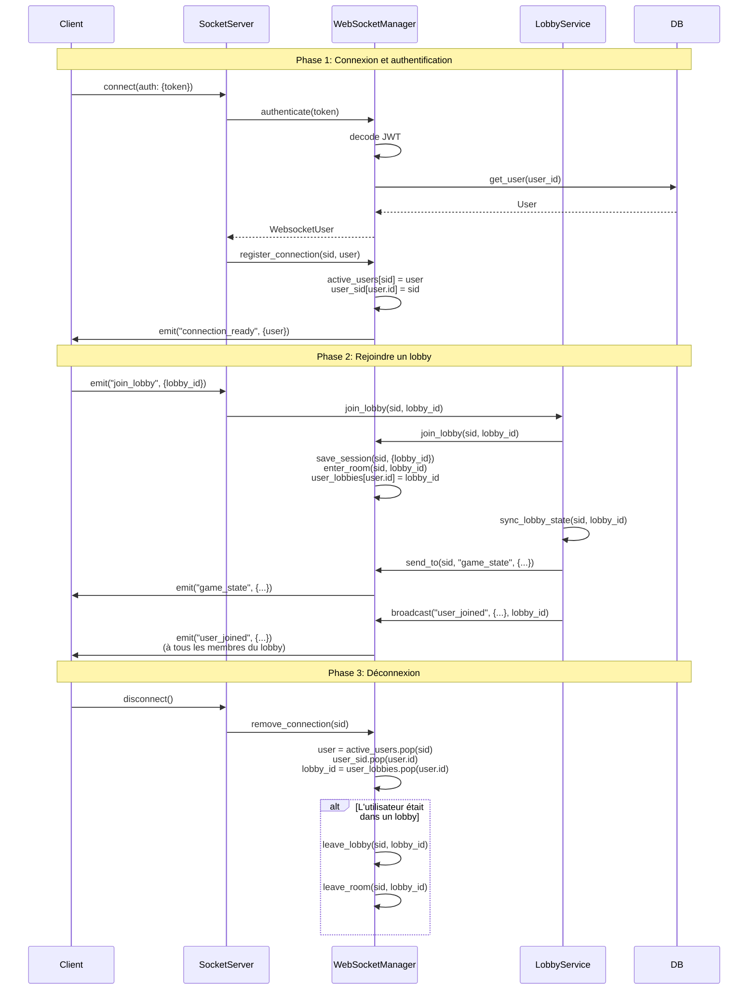
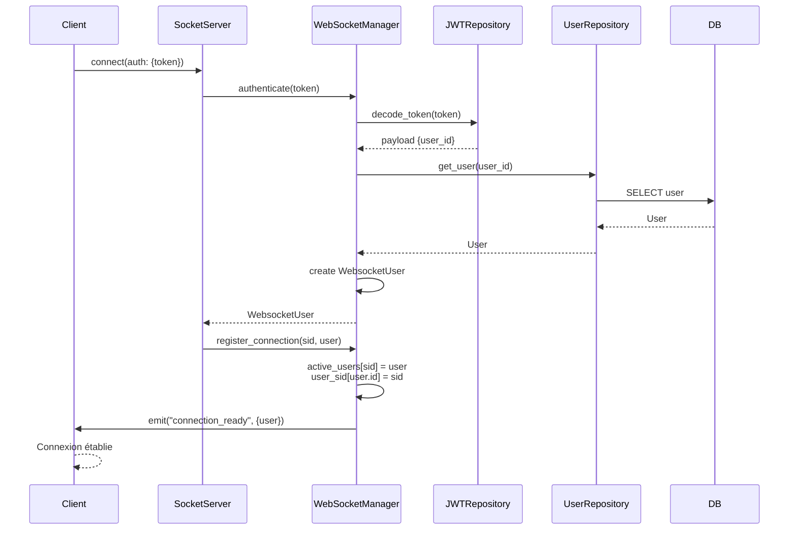
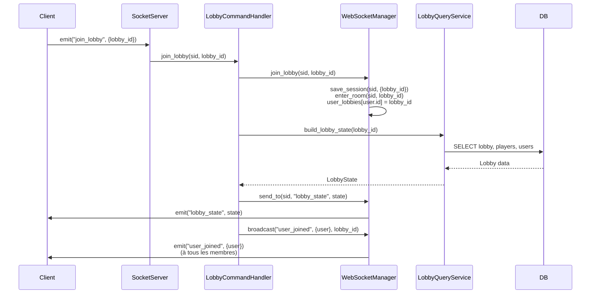
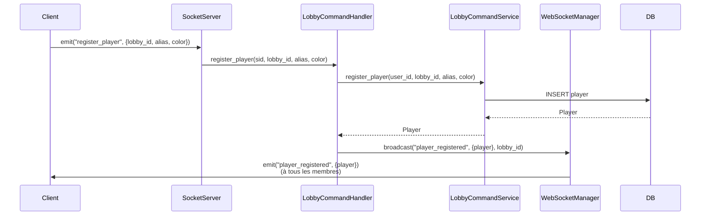
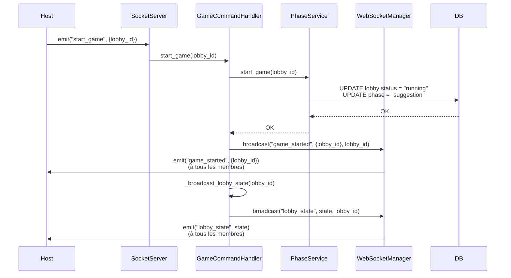
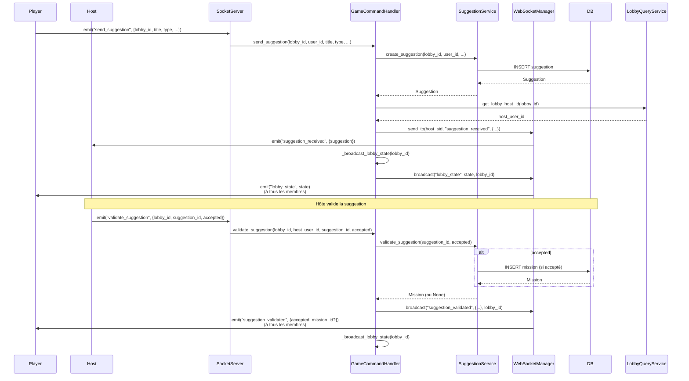
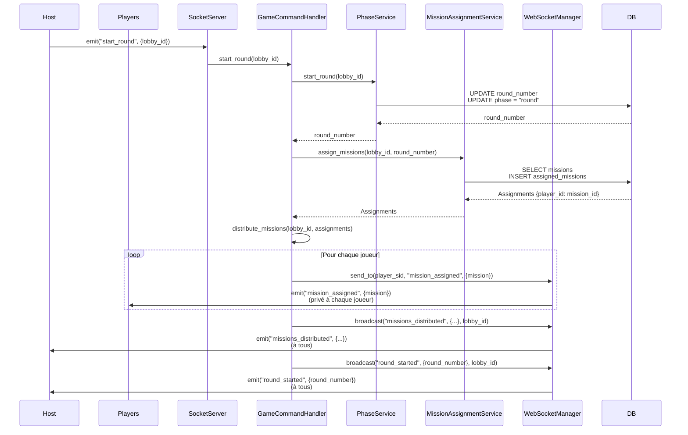
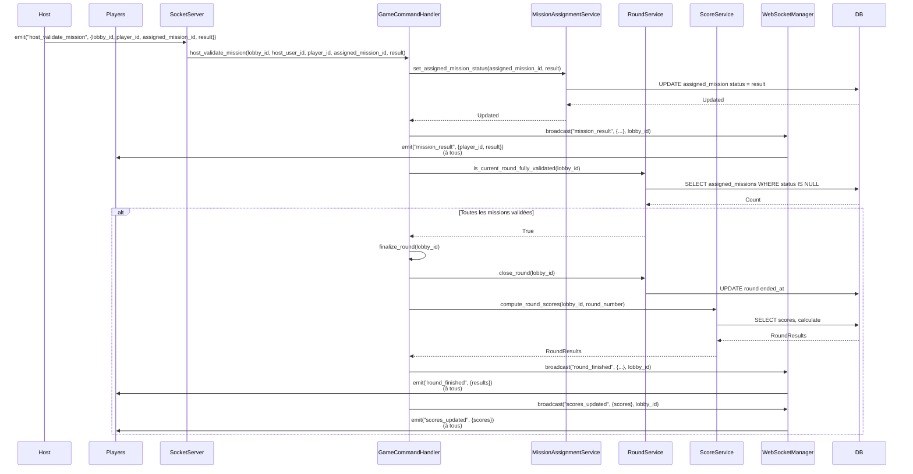
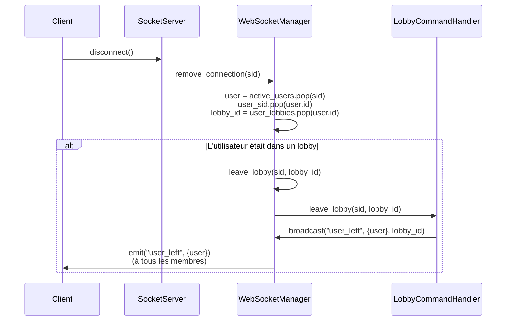
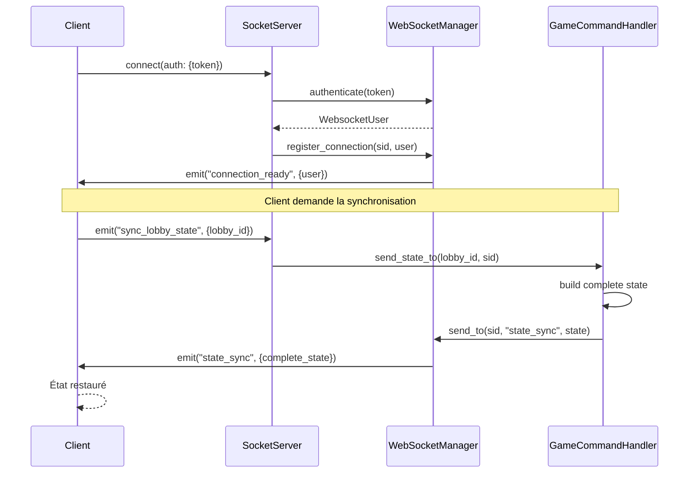

# WebSocket

Ce document présente le système WebSocket complet du backend Shadow Role, incluant :

- l'architecture
- le WebSocketManager
- les événements
- et les workflows.

## Vue d'ensemble

Shadow Role utilise **Socket.IO** pour la communication temps réel entre le client et le serveur.

Le système WebSocket permet :

- ✅ Authentification via JWT
- ✅ Gestion des connexions et déconnexions
- ✅ Communication en temps réel (lobbies, jeu)
- ✅ Synchronisation d'état
- ✅ Broadcast aux rooms Socket.IO

## Architecture

```
┌─────────────────────────────────────────┐
│         Client (Socket.IO Client)       │
│  connect, emit, on events               │
└──────────────┬──────────────────────────┘
               │ WebSocket (Socket.IO)
┌──────────────▼──────────────────────────┐
│      Socket Server (socket_server.py)   │
│  - Événements de connexion              │
│  - Routage vers les handlers            │
└──────────────┬──────────────────────────┘
               │
    ┌──────────┴──────────┐
    │                     │
┌───▼──────────┐   ┌──────▼──────────┐
│ WebSocket    │   │ Handlers        │
│ Manager      │   │ - LobbyCommand  │
│ - Connexions │   │ - GameCommand   │
│ - Rooms      │   └─────────────────┘
│ - Broadcast  │
└──────────────┘
```

## Composants Principaux

### WebSocketManager

Gestionnaire central des connexions WebSocket. Responsable de :

- Authentification des utilisateurs
- Gestion des mappings (sid ↔ user_id ↔ lobby_id)
- Gestion des rooms Socket.IO
- Communication (send_to, broadcast)

### Handlers

Orchestrent la logique métier entre WebSocket et Services :

- **LobbyCommandHandler** : Gestion des lobbies et joueurs
- **GameCommandHandler** : Gestion du jeu et des phases

### Services

Services spécialisés pour la logique métier :

- PhaseService, LobbyCommandService, SuggestionService, etc.

## Endpoint

Socket.IO est exposé sur : `https://<domaine>/ws/socket.io`

### Configuration Client

```typescript
import { io } from "socket.io-client";

const socket = io("https://api.example.com", {
  path: "/ws/socket.io",
  auth: { token: localStorage.getItem("access_token") },
});
```

### Authentification

Le JWT (access token) est transmis via `auth.token` dans le handshake. Le serveur valide le token avant d'accepter la connexion.

---

## WebSocketManager

Le `WebSocketManager` est le composant central qui gère toutes les connexions WebSocket, l'authentification, et la communication avec les clients.

**Fichier** : `backend/app/websocket/manager.py`

### Vue d'ensemble

Le `WebSocketManager` maintient l'état de toutes les connexions actives et fournit des méthodes pour :

- Authentifier les utilisateurs via JWT
- Gérer les connexions/déconnexions
- Gérer l'appartenance aux lobbies (rooms Socket.IO)
- Envoyer des messages individuels ou en broadcast

### Structures de données

Le manager maintient trois mappings principaux pour un accès rapide :

```python
class WebSocketManager:
    def __init__(self, sio_server):
        # Mapping: Session ID → Utilisateur WebSocket
        self.active_users: Dict[str, WebsocketUser] = {}

        # Mapping: User ID → Session ID (inverse)
        self.user_sid: Dict[uuid.UUID, str] = {}

        # Mapping: User ID → Lobby ID (lobby actuel de l'utilisateur)
        self.user_lobbies: Dict[uuid.UUID, uuid.UUID] = {}
```

**Pourquoi trois mappings ?**

- `active_users[sid]` : Trouver rapidement l'utilisateur depuis une session Socket.IO
- `user_sid[user_id]` : Trouver rapidement la session d'un utilisateur (pour envoyer un message direct)
- `user_lobbies[user_id]` : Connaître le lobby actuel d'un utilisateur (pour nettoyage à la déconnexion)

### Méthodes principales

#### 🔐 Authentification

##### `authenticate(token: str) -> WebsocketUser`

Authentifie un utilisateur via un JWT et retourne un objet `WebsocketUser`.

**Processus :**

1. Décode le token JWT avec `JWTRepository`
2. Extrait le `user_id` du payload
3. Récupère l'utilisateur depuis la base de données
4. Retourne un `WebsocketUser` ou lève une exception

**Exceptions :**

- `ConnectionRefusedError("User not found")`
- `ConnectionRefusedError("Invalid or expired token")`

**Exemple :**

```python
try:
    user = await manager.authenticate(token)
except ConnectionRefusedError:
    # Connexion refusée
    pass
```

#### 🔌 Gestion des connexions

##### `register_connection(sid: str, user: WebsocketUser)`

Enregistre une nouvelle connexion WebSocket.

**Actions :**

1. Ajoute l'utilisateur dans `active_users[sid]`
2. Ajoute le mapping inverse dans `user_sid[user.id]`
3. Envoie l'événement `connection_ready` au client

**Événement envoyé :**

```json
{
  "user": {
    "id": "uuid-string",
    "user_id": "uuid",
    "username": "john_doe"
  }
}
```

**Exemple :**

```python
user = await manager.authenticate(token)
await manager.register_connection(sid, user)
```

##### `remove_connection(sid: str)`

Nettoie proprement une connexion lors de la déconnexion.

**Actions :**

1. Retire l'utilisateur de `active_users`
2. Retire le mapping `user_sid`
3. Si l'utilisateur était dans un lobby, le retire automatiquement via `leave_lobby`
4. Nettoie le mapping `user_lobbies`

**Ordre d'exécution :**

```python
user = active_users.pop(sid)           # 1. Retirer de active_users
user_sid.pop(user.id)                  # 2. Retirer le mapping inverse
lobby_id = user_lobbies.pop(user.id)   # 3. Récupérer le lobby
if lobby_id:
    await leave_lobby(sid, lobby_id)   # 4. Quitter le lobby
```

**Exemple :**

```python
await manager.remove_connection(sid)
```

#### 🏠 Gestion des lobbies

##### `join_lobby(sid: str, lobby_id: str)`

Ajoute un utilisateur à un lobby (room Socket.IO).

**Actions :**

1. Récupère l'utilisateur depuis `active_users[sid]`
2. Sauvegarde le `lobby_id` dans la session Socket.IO
3. Ajoute le client à la room Socket.IO correspondant au lobby
4. Enregistre le mapping `user_lobbies[user.id] = lobby_id`

**Important :** Une fois dans une room, l'utilisateur recevra tous les événements broadcastés à cette room.

**Exemple :**

```python
# L'utilisateur rejoint le lobby "abc123"
await manager.join_lobby("session_xyz", "abc123")

# Maintenant, tous les broadcasts à la room "abc123"
# seront reçus par cet utilisateur
await manager.broadcast("game_started", {...}, "abc123")
```

##### `leave_lobby(sid: str, lobby_id: str)`

Retire un utilisateur d'un lobby.

**Actions :**

1. Retire le client de la room Socket.IO
2. Retire le mapping `user_lobbies[user.id]`

**Note :** Cette méthode est appelée automatiquement lors de `remove_connection`.

**Exemple :**

```python
await manager.leave_lobby(sid, "abc123")
```

#### 📨 Communication

##### `send_to(sid: str, event: str, data: dict)`

Envoie un événement à un utilisateur spécifique.

**Utilisation :** Pour envoyer des messages privés ou synchroniser l'état à un seul client.

**Exemple :**

```python
# Envoyer l'état du lobby à un nouveau client
await manager.send_to(
    sid="session_xyz",
    event="game_state",
    data={"game": lobby_state.model_dump()}
)
```

##### `broadcast(event: str, data: dict, lobby_id: str)`

Diffuse un événement à tous les utilisateurs d'un lobby.

**Utilisation :** Pour notifier tous les membres d'un lobby d'un changement.

**Exemple :**

```python
# Notifier tous les membres qu'un joueur s'est inscrit
await manager.broadcast(
    event="player_registered",
    data={"player": player_data},
    lobby_id="abc123"
)
```

**Important :** Tous les clients qui ont rejoint la room via `join_lobby` recevront cet événement.

### Flux de vie d'une connexion

#### Diagramme de séquence



### Gestion des erreurs

#### Connexion refusée

Si l'authentification échoue, une `ConnectionRefusedError` est levée, ce qui empêche la connexion :

```python
try:
    user = await manager.authenticate(token)
except ConnectionRefusedError as e:
    # La connexion est refusée
    # Le client ne peut pas se connecter
    logger.error(f"Connection refused: {e}")
```

#### Utilisateur non trouvé

Si un `sid` n'existe pas dans `active_users`, les méthodes lèvent une `KeyError`. C'est pourquoi il est important de vérifier l'existence avant d'utiliser :

```python
user = manager.active_users.get(sid)
if not user:
    raise ValueError("User not found")
```

#### Bonnes pratiques pour la gestion d'erreurs

```python
# Toujours utiliser .get() pour éviter KeyError
user = manager.active_users.get(sid)
if not user:
    logger.warning(f"User not found for sid: {sid}")
    return

# Vérifier l'existence avant d'envoyer
if sid in manager.active_users:
    await manager.send_to(sid, "event", data)
```

### Exemples d'utilisation

#### Envoyer un message privé

```python
# Trouver le sid d'un utilisateur
user_id = uuid.UUID("...")
sid = manager.user_sid.get(user_id)

if sid:
    await manager.send_to(
        sid,
        "mission_assigned",
        {"mission": mission_data}
    )
```

#### Broadcast à un lobby

```python
# Tous les utilisateurs du lobby recevront cet événement
await manager.broadcast(
    "game_started",
    {"lobby_id": str(lobby_id)},
    str(lobby_id)
)
```

#### Vérifier si un utilisateur est connecté

```python
user_id = uuid.UUID("...")
is_connected = user_id in manager.user_sid

if is_connected:
    sid = manager.user_sid[user_id]
    # Envoyer un message
```

---

## Événements WebSocket

### 🔌 Connexion

| Event              | Direction   | Payload                   | Description                                  |
| ------------------ | ----------- | ------------------------- | -------------------------------------------- |
| `connect`          | client → WS | `{ token }` (dans auth)   | Le client se connecte au serveur             |
| `connection_ready` | WS → client | `{ user: WebsocketUser }` | Confirmation de connexion avec l'utilisateur |
| `disconnect`       | client → WS | -                         | Déconnexion volontaire                       |

### 🏠 Lobby

| Event         | Direction   | Payload                             | Description                       |
| ------------- | ----------- | ----------------------------------- | --------------------------------- |
| `join_lobby`  | client → WS | `{ lobby_id: string }`              | Rejoindre un lobby                |
| `leave_lobby` | client → WS | `{ lobby_id: string }`              | Quitter un lobby                  |
| `user_joined` | WS → tous   | `{ user: WebsocketUser, lobby_id }` | Un utilisateur a rejoint le lobby |
| `user_left`   | WS → tous   | `{ user: WebsocketUser, lobby_id }` | Un utilisateur a quitté le lobby  |

### 👤 Gestion des Joueurs

| Event                 | Direction   | Payload                       | Description                           |
| --------------------- | ----------- | ----------------------------- | ------------------------------------- |
| `register_player`     | client → WS | `{ lobby_id, alias, color }`  | S'inscrire comme joueur               |
| `player_registered`   | WS → tous   | `{ player: WebSocketPlayer }` | Un joueur a été inscrit               |
| `unregister_player`   | client → WS | `{ lobby_id, user_id }`       | Se désinscrire (redevenir spectateur) |
| `player_unregistered` | WS → tous   | `{ user_id: string }`         | Un joueur a été désinscrit            |

**WebSocketPlayer** :

```typescript
{
  user_id: string;
  alias: string;
  color: string;
  score: number;
  missions: MissionAssigned[];
}
```

### 🎮 Session de Jeu

| Event              | Direction   | Payload                           | Description                            |
| ------------------ | ----------- | --------------------------------- | -------------------------------------- |
| `start_game`       | hôte → WS   | `{ lobby_id }`                    | Démarrer la partie                     |
| `game_started`     | WS → tous   | `{ lobby_id }`                    | La partie a démarré                    |
| `end_game`         | hôte → WS   | `{ lobby_id }`                    | Terminer la partie                     |
| `game_finished`    | WS → tous   | `{ lobby_id }`                    | La partie est terminée                 |
| `sync_lobby_state` | client → WS | `{ lobby_id }`                    | Demander la synchronisation de l'état  |
| `lobby_state`      | WS → client | `{ WebSocketLobbyState }`         | État complet du lobby                  |
| `state_sync`       | WS → client | `{ session_state + lobby_state }` | Synchronisation complète (reconnexion) |

**WebSocketLobbyState** :

```typescript
{
  users: WebsocketUser[];
  status: GameStatus;        // "waiting" | "running" | "finished"
  phase: GamePhase;          // "lobby" | "suggestion" | "round" | "validation"
  current_round: number;
  players: WebSocketPlayer[];
  spectators: WebsocketUser[];
  host: WebsocketUser;
}
```

### 🧭 Phases de Jeu

| Event              | Direction | Payload               | Description                   |
| ------------------ | --------- | --------------------- | ----------------------------- |
| `start_game_phase` | hôte → WS | `{ lobby_id, phase }` | Démarrer une phase spécifique |
| `start_suggestion` | hôte → WS | `{ lobby_id }`        | Démarrer la phase suggestion  |
| `start_round`      | hôte → WS | `{ lobby_id }`        | Démarrer un round             |
| `start_validation` | hôte → WS | `{ lobby_id }`        | Démarrer la phase validation  |

### 💡 Phase Suggestion

| Event                           | Direction   | Payload                                                                | Description                    |
| ------------------------------- | ----------- | ---------------------------------------------------------------------- | ------------------------------ |
| `send_suggestion`               | joueur → WS | `{ lobby_id, title, type, description?, difficulty? }`                 | Proposer une mission/rôle      |
| `suggestion_received`           | WS → hôte   | `{ suggestion_id, player_id, title, type, description?, difficulty? }` | Notification à l'hôte          |
| `suggestion_received_broadcast` | WS → tous   | `{ suggestion_id, player_id, title, type }`                            | Broadcast de la suggestion     |
| `validate_suggestion`           | hôte → WS   | `{ lobby_id, suggestion_id, accepted }`                                | Valider/rejeter une suggestion |
| `suggestion_validated`          | WS → tous   | `{ suggestion_id, accepted, mission_id? }`                             | Résultat de la validation      |

### 🎯 Phase Round

| Event                  | Direction   | Payload                                         | Description                             |
| ---------------------- | ----------- | ----------------------------------------------- | --------------------------------------- |
| `start_round`          | hôte → WS   | `{ lobby_id }`                                  | Démarrer un round                       |
| `round_started`        | WS → tous   | `{ round_number, player_count }`                | Round démarré                           |
| `mission_assigned`     | WS → joueur | `{ mission: MissionDetails }`                   | Mission assignée (privé au joueur)      |
| `missions_distributed` | WS → tous   | `{ lobby_id, player_count }`                    | Toutes les missions ont été distribuées |
| `finalize_round`       | hôte → WS   | `{ lobby_id }`                                  | Finaliser le round actuel               |
| `round_finished`       | WS → tous   | `{ round_number, round_id, ended_at, results }` | Round terminé avec résultats            |

### ✅ Phase Validation

| Event                   | Direction | Payload                                                | Description                        |
| ----------------------- | --------- | ------------------------------------------------------ | ---------------------------------- |
| `host_validate_mission` | hôte → WS | `{ lobby_id, player_id, assigned_mission_id, result }` | Valider une mission (success/fail) |
| `mission_result`        | WS → tous | `{ player_id, assigned_mission_id, result }`           | Résultat d'une mission validée     |
| `scores_updated`        | WS → tous | `{ scores: RoundResults }`                             | Scores mis à jour après validation |

### Exemples d'Utilisation

#### Connexion et Rejoindre un Lobby

```typescript
// Connexion
const socket = io("https://api.example.com", {
  path: "/ws/socket.io",
  auth: { token: accessToken },
});

socket.on("connection_ready", (data) => {
  // Rejoindre un lobby
  socket.emit("join_lobby", { lobby_id: "lobby-uuid" });
});

socket.on("user_joined", (data) => {
  console.log("User joined:", data.user);
});
```

#### S'inscrire comme Joueur

```typescript
socket.emit("register_player", {
  lobby_id: "lobby-uuid",
  alias: "Mon Alias",
  color: "#FF0000",
});

socket.on("player_registered", (data) => {
  console.log("Player:", data.player);
});
```

#### Démarrer une Partie

```typescript
socket.emit("start_game", { lobby_id: "lobby-uuid" });

socket.on("game_started", (data) => {
  console.log("Game started!");
});
```

#### Proposer une Suggestion

```typescript
socket.emit("send_suggestion", {
  lobby_id: "lobby-uuid",
  title: "Ma Mission",
  type: "mission",
  description: "Description optionnelle",
  difficulty: 3,
});

socket.on("suggestion_validated", (data) => {
  if (data.accepted) {
    console.log("Suggestion accepted:", data.mission_id);
  }
});
```

## Workflows WebSocket

### 🔌 Connexion et Authentification

#### Diagramme de séquence



#### Étapes détaillées

1. **Client se connecte** avec un JWT dans `auth.token`
2. **Serveur authentifie** via `WebSocketManager.authenticate()`
3. **Token décodé** pour extraire `user_id`
4. **Utilisateur récupéré** depuis la base de données
5. **Connexion enregistrée** dans les mappings
6. **Événement `connection_ready`** envoyé au client

### 🏠 Rejoindre un Lobby

#### Diagramme de séquence



#### Étapes détaillées

1. **Client émet** `join_lobby` avec le `lobby_id`
2. **Handler traite** la requête
3. **WebSocketManager** ajoute le client à la room Socket.IO
4. **État du lobby** construit et envoyé au nouveau client
5. **Broadcast** `user_joined` à tous les membres du lobby

### 👤 S'inscrire comme Joueur

#### Diagramme de séquence



#### Étapes détaillées

1. **Client émet** `register_player` avec alias et couleur
2. **Service crée** le joueur en base de données
3. **Broadcast** `player_registered` à tous les membres du lobby

### 🎮 Démarrer une Partie

#### Diagramme de séquence



#### Étapes détaillées

1. **Hôte émet** `start_game`
2. **PhaseService** démarre le jeu (status = "running", phase = "suggestion")
3. **Broadcast** `game_started` à tous les membres
4. **Synchronisation** de l'état du lobby

### 💡 Phase Suggestion

#### Diagramme de séquence



#### Étapes détaillées

1. **Joueur propose** une suggestion via `send_suggestion`
2. **Suggestion créée** en base de données
3. **Hôte notifié** via `suggestion_received` (privé)
4. **État du lobby** synchronisé
5. **Hôte valide** via `validate_suggestion`
6. **Mission créée** si acceptée
7. **Broadcast** `suggestion_validated` à tous

### 🎯 Phase Round

#### Diagramme de séquence



#### Étapes détaillées

1. **Hôte démarre** le round
2. **Round créé** en base de données
3. **Missions assignées** aux joueurs
4. **Missions distribuées** en privé à chaque joueur
5. **Broadcast** `round_started` et `missions_distributed`

### ✅ Phase Validation

#### Diagramme de séquence



#### Étapes détaillées

1. **Hôte valide** une mission (success/fail)
2. **Statut mis à jour** en base de données
3. **Broadcast** `mission_result` à tous
4. **Vérification** si toutes les missions sont validées
5. **Si oui** : Round finalisé, scores calculés
6. **Broadcast** `round_finished` et `scores_updated`

### 🔌 Déconnexion et Reconnexion

#### Déconnexion



#### Reconnexion



---

## Quick Start

### Connexion

```typescript
const socket = io("https://api.example.com", {
  path: "/ws/socket.io",
  auth: { token: accessToken },
});

socket.on("connection_ready", (data) => {
  console.log("Connected:", data.user);
});
```

### Rejoindre un Lobby

```typescript
socket.emit("join_lobby", { lobby_id: "lobby-uuid" });

socket.on("user_joined", (data) => {
  console.log("User joined:", data.user);
});
```

### S'inscrire comme Joueur

```typescript
socket.emit("register_player", {
  lobby_id: "lobby-uuid",
  alias: "Mon Alias",
  color: "#FF0000",
});

socket.on("player_registered", (data) => {
  console.log("Player registered:", data.player);
});
```

---

## Bonnes Pratiques

### WebSocketManager

1. **Toujours vérifier l'existence** : Utiliser `.get()` plutôt que `[]` pour accéder aux mappings
2. **Nettoyage automatique** : `remove_connection` gère automatiquement le nettoyage des lobbies
3. **Utiliser les rooms** : Préférer `broadcast` à une room plutôt que d'envoyer individuellement à chaque utilisateur
4. **Sessions Socket.IO** : Les sessions sont utilisées pour persister le `lobby_id` entre les reconnexions

### Gestion des erreurs

- ✅ Toujours utiliser `.get()` pour éviter `KeyError`
- ✅ Vérifier l'existence avant d'envoyer des messages
- ✅ Logger les erreurs de connexion
- ✅ Gérer proprement les déconnexions

### Communication

- ✅ Utiliser `send_to` pour les messages privés
- ✅ Utiliser `broadcast` pour notifier tous les membres d'un lobby
- ✅ Synchroniser l'état après chaque action importante
- ✅ Gérer les reconnexions avec `sync_lobby_state`

---

## Voir aussi

- [Orchestration Handlers ↔ Services](./ORCHESTRATION.md) - Détails sur les handlers
- [Authentification](./authentication.md) - JWT et authentification
- [Architecture Backend](./architecture.md) - Architecture générale
