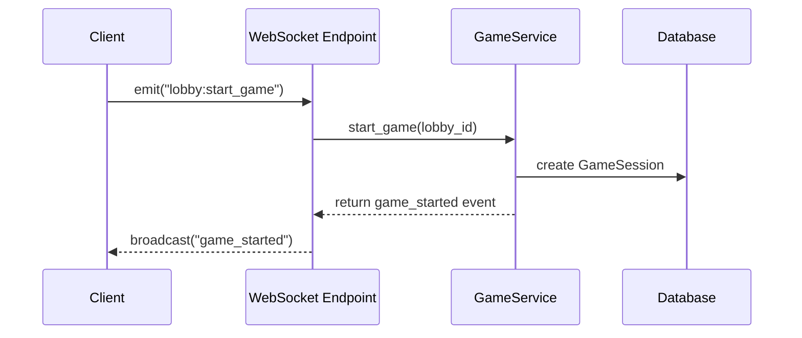

# WebSocket — Architecture technique

## Endpoint

- Socket.IO exposé sur `https://<domaine>/ws/socket.io`
- Les clients doivent initialiser la connexion avec le path explicite :

```ts
import { io } from "socket.io-client";

const socket = io("https://<domaine_api>.io", {
  path: "/ws/socket.io",
  auth: { token: localStorage.getItem("access_token") },
});
```

### Authentification Socket.IO

- Le JWT (access token) est transmis via `auth.token` dans le handshake.
- Côté serveur, le handler `connect` valide le token et enregistre un utilisateur :

## Messages WebSocket

### Serveur → clients

| Événement          | Description                                                                   | Payload principal                                   |
| ------------------ | ----------------------------------------------------------------------------- | --------------------------------------------------- |
| `connection_ready` | Confirmation d’authentification et snapshot utilisateur                       | `{ user: { id, username, email, ... } }`            |
| `lobby_snapshot`   | État complet des utilisateurs du lobby (envoyé uniquement au nouvel arrivant) | `{ users: [ ... ] }`                                |
| `lobby_joined`     | Un joueur rejoint le lobby                                                    | `{ user: { ... }, alias?: string, color?: string }` |
| `user_left`        | Un joueur quitte le lobby                                                     | `{ user: [{ ... }] }` (compat héritée)              |
| `game_started`     | Début du jeu                                                                  | `{ game: { status, started_by, ... } }`             |
| `game_update`      | Mise à jour partielle de l’état du jeu                                        | `{ game: { status?, phase?, ... } }`                |
| `game_ended`       | Fin de partie                                                                 | `{ game: { status: "completed", ... } }`            |

### Client → serveur

| Événement                      | Description                           | Payload attendu                                        |
| ------------------------------ | ------------------------------------- | ------------------------------------------------------ |
| `join_lobby`                   | Rejoint un lobby                      | `{ lobby_id: string, alias?: string, color?: string }` |
| `update_status`                | Change son état (prêt, inactif, etc.) | `{ status: string }`                                   |
| `complete_mission`             | Indique une mission accomplie         | `{ mission_id: string }`                               |
| `lobby:start_game`             | Démarre ou reprend la partie          | `{}`                                                   |
| `lobby:pause_game`             | Met la partie en pause                | `{}`                                                   |
| `lobby:start_proposal_phase`   | Lance la phase de propositions        | `{}`                                                   |
| `lobby:start_round`            | Démarre une nouvelle manche           | `{}`                                                   |
| `lobby:start_validation_phase` | Démarre la phase de validation        | `{}`                                                   |
| `lobby:end_round`              | Termine la manche en cours            | `{}`                                                   |
| `lobby:end_game`               | Clôture la partie                     | `{}`                                                   |
| `ping`                         | Keep-alive                            | `{}`                                                   |

### Exemple de communication

```json
// Client → Serveur
{
  "event": "join_lobby",
  "payload": {
    "lobby_id": 42,
    "alias": "Alice",
    "color": "#60A5FA"
  }
}

// Serveur → Tous les clients du lobby
{
  "event": "lobby_joined",
  "payload": {
    "user": {
      "id": "uuid",
      "username": "alice",
      "email": "alice@example.com"
    },
    "alias": "Alice",
    "color": "#60A5FA"
  }
}
```

### Cycle d’un événement


