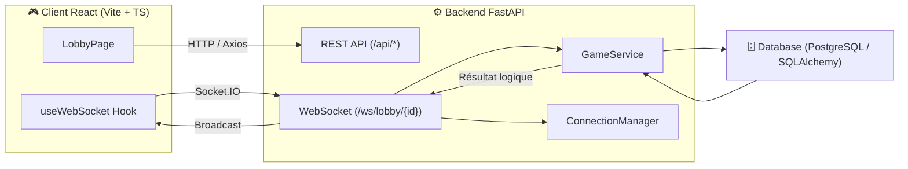
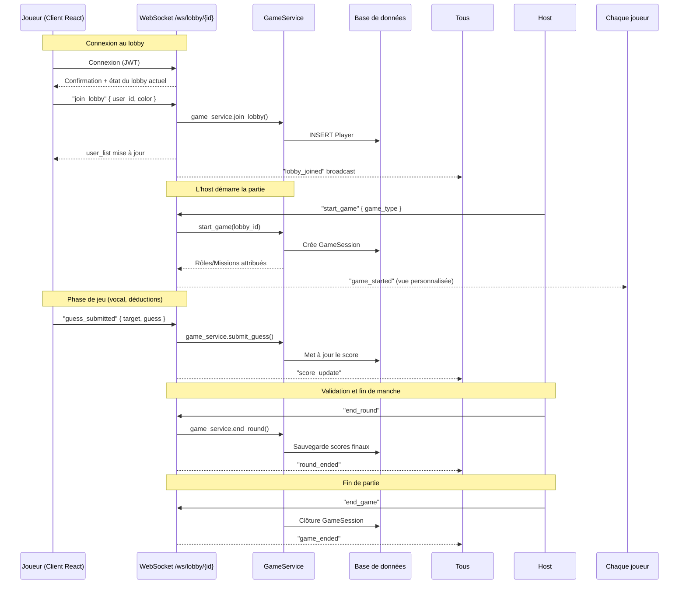

# 🔄 Flux de communication — ShadowRole

Ce document décrit la manière dont les différents éléments du système **communiquent entre eux** pendant une partie.  
Il couvre à la fois les **flux REST** et les **flux WebSocket**.

---

## 🧭 Vue générale



---

## ⚙️ 1. Communication REST (avant le temps réel)

Certaines actions passent par l’API REST, notamment :

| Action               | Endpoint                                | Description                                |
| -------------------- | --------------------------------------- | ------------------------------------------ |
| 🔑 Authentification  | `/api/auth/login`, `/api/auth/register` | Retourne un token JWT                      |
| 🏠 Création de lobby | `/api/lobbies/create`                   | Crée un lobby vide et définit un hôte      |
| 📋 Liste des lobbies | `/api/lobbies`                          | Récupère les lobbies disponibles           |
| 💡 Suggestion        | `/api/missions/suggest`                 | Permet à un joueur de proposer une mission |
| 📜 Historique        | `/api/games/history`                    | Liste les anciennes parties                |

Ces appels REST sont faits **avant** ou **entre** les sessions WebSocket.

---

## ⚡ 2. Communication WebSocket — pendant la partie

Chaque lobby correspond à une **room Socket.IO** :

`/ws/lobby/{lobby_id}`

Les clients (joueurs) s’y connectent avec leur JWT.

Une fois connectés, toutes les actions temps réel (join, start, mission, score...) passent par cette socket.

---

### 🧩 Schéma séquentiel complet

Ce diagramme illustre le **cycle de communication WebSocket** pendant une partie.



---

## 🧠 3. Rôle des composants backend

### **ConnectionManager**

Gère la couche WebSocket :

- Authentifie le joueur via JWT.
- L’ajoute dans la room correspondant au lobby.
- Transmet les événements entrants à `GameService`.
- Diffuse les événements sortants à tous les clients du lobby.

Exemple :

```python
await manager.broadcast("lobby_joined", data, room=lobby_id)

```

---

### **GameService**

C’est le “cerveau” de la partie :

- Gère les états du jeu (`waiting`, `running`, `ended`)
- Attribue les rôles/missions
- Met à jour les scores
- Sauvegarde les états dans la base

Exemple :

```python
class GameService:
    async def start_game(self, lobby_id):
        players = await self.repo.get_players(lobby_id)
        missions = await self.repo.assign_missions(players)
        return GameState(players=players, missions=missions, status="running")

```

---

## 🔁 4. Événements WebSocket standardisés

| Type               | Direction        | Payload                | Description                       |
| ------------------ | ---------------- | ---------------------- | --------------------------------- |
| `join_lobby`       | client → serveur | `{ user_id, color }`   | Un joueur rejoint la room         |
| `lobby_joined`     | serveur → tous   | `{ user: [...] }`      | Liste mise à jour des joueurs     |
| `start_game`       | host → serveur   | `{ game_type }`        | L’host démarre la partie          |
| `game_started`     | serveur → tous   | `{ game: {...} }`      | Début de partie avec état initial |
| `mission_assigned` | serveur → joueur | `{ mission }`          | Mission secrète personnelle       |
| `guess_submitted`  | joueur → serveur | `{ target, guess }`    | Proposition du joueur             |
| `score_update`     | serveur → tous   | `{ player_id, score }` | Mise à jour des scores            |
| `round_ended`      | serveur → tous   | `{ results }`          | Fin de manche                     |
| `game_ended`       | serveur → tous   | `{ summary }`          | Fin de partie globale             |

---

## 📡 5. Exemple de flux en front (React)

```tsx
// Connexion
const socket = io(`${API_URL}/ws/lobby/${lobbyId}`, {
  auth: { token: user.jwt },
});

// Écoute des événements
socket.on("lobby_joined", updatePlayers);
socket.on("game_started", setGameState);
socket.on("score_update", updateScores);

// Émission d’actions
socket.emit("join_lobby", { user_id, color });
socket.emit("start_game", { game_type: "roles" });
socket.emit("guess_submitted", { target, guess });
```

---

## 📊 6. Synthèse des responsabilités

| Couche               | Responsabilité principale                                               |
| -------------------- | ----------------------------------------------------------------------- |
| **Frontend (React)** | Émet et écoute les événements WebSocket, gère l’état du jeu côté client |
| **WebSocket Server** | Gère les connexions et route les événements                             |
| **GameService**      | Contient la logique de partie (états, rôles, missions, scores)          |
| **Database**         | Persiste les entités de jeu et leurs évolutions                         |
| **REST API**         | Gère les actions non temps réel (auth, création, suggestions)           |
