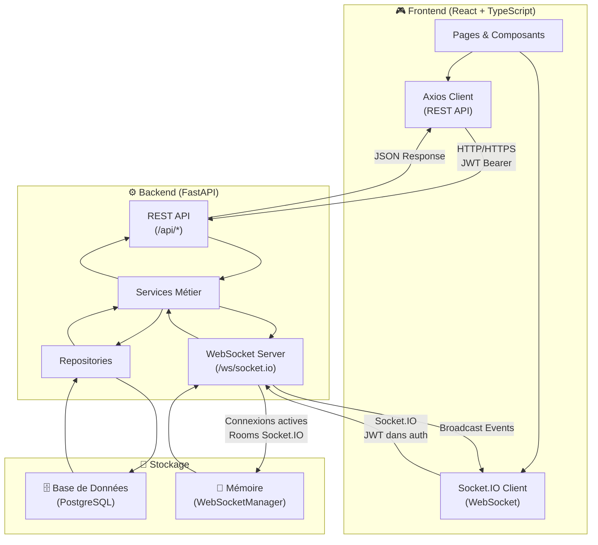

# 🔄 Communication — ShadowRole

Ce document décrit comment les différents composants du système **communiquent entre eux** : Frontend, Backend (API REST et WebSocket), et Base de données.

## 🧭 Vue d'ensemble

Shadow Role utilise deux canaux de communication principaux :

- **API REST** : Pour les opérations CRUD, l'authentification et la gestion des ressources
- **WebSocket (Socket.IO)** : Pour la communication temps réel pendant les parties (lobbies, jeu en cours)

```mermaid
flowchart TB
    subgraph Frontend["🎮 Frontend (React + TypeScript)"]
        A1["Pages & Composants"]
        A2["Axios Client<br/>(REST API)"]
        A3["Socket.IO Client<br/>(WebSocket)"]
    end

    subgraph Backend["⚙️ Backend (FastAPI)"]
        B1["REST API<br/>(/api/*)"]
        B2["WebSocket Server<br/>(/ws/socket.io)"]
        B3["Services Métier"]
        B4["Repositories"]
    end

    subgraph Storage["💾 Stockage"]
        DB["🗄️ Base de Données<br/>(PostgreSQL)"]
        MEM["🧠 Mémoire<br/>(WebSocketManager)"]
    end

    A1 --> A2
    A1 --> A3
    A2 -->|HTTP/HTTPS<br/>JWT Bearer| B1
    A3 -->|Socket.IO<br/>JWT dans auth| B2
    B1 --> B3
    B2 --> B3
    B3 --> B4
    B4 --> DB
    DB --> B4
    B4 --> B3
    B3 --> B1
    B3 --> B2
    B2 -->|Connexions actives<br/>Rooms Socket.IO| MEM
    MEM --> B2
    B2 -->|Broadcast Events| A3
    B1 -->|JSON Response| A2
```

## 📡 Communication REST API

L'API REST est utilisée pour toutes les opérations qui ne nécessitent pas de temps réel :

- ✅ **Authentification** : login, logout, refresh token, activation, réinitialisation de mot de passe
- ✅ **Gestion des ressources** : CRUD sur les jeux, missions, lobbies
- ✅ **Consultation** : Lister les lobbies, obtenir les détails d'un joueur, récupérer les missions
- ✅ **Opérations ponctuelles** : Actions ne nécessitant pas de synchronisation en temps réel

📖 **Voir [Référence API REST](../backend/API_REFERENCE.md)** pour la liste complète des endpoints.

## ⚡ Communication WebSocket

Les WebSockets sont utilisés pour la communication temps réel pendant les parties et dans les lobbies :

- ✅ **Dans un lobby** : Rejoindre/quitter, s'inscrire comme joueur, synchronisation d'état
- ✅ **Pendant une partie** : Démarrage, phases de jeu, suggestions, rounds, validation
- ✅ **Temps réel** : Broadcast d'événements à tous les membres d'un lobby
- ✅ **Notifications** : Événements qui doivent être synchronisés immédiatement entre clients

📖 **Voir [Documentation WebSocket](../backend/websocket.md)** pour plus de détails sur les événements et workflows.

## 📚 Documentation détaillée

- **[Référence API REST](../backend/API_REFERENCE.md)** : Liste complète des endpoints REST avec leurs paramètres et réponses
- **[Documentation WebSocket](../backend/websocket.md)** : Architecture, événements, workflows et exemples d'utilisation
- **[Architecture Backend](../backend/backend_architecture.md)** : Vue d'ensemble de l'architecture backend
- **[Authentification](../backend/authentication.md)** : Détails sur JWT et l'authentification
