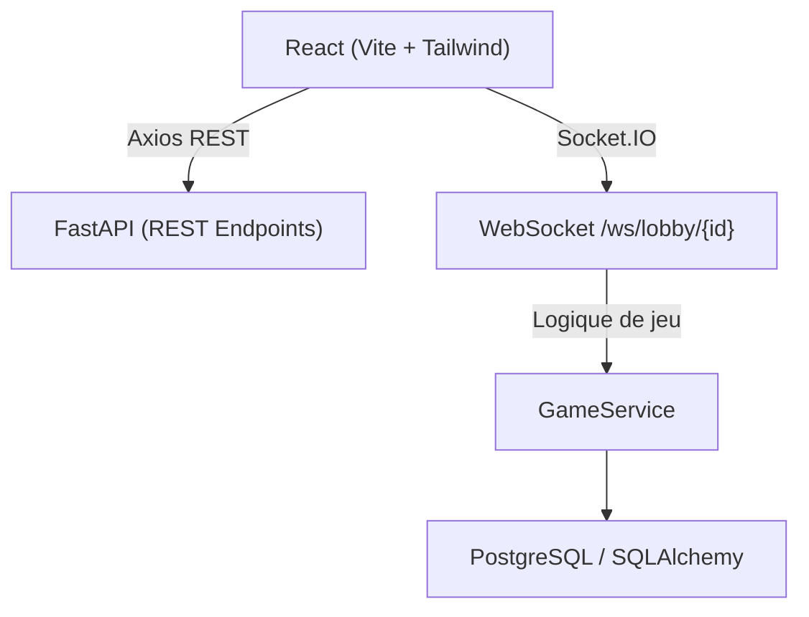

# Architecture Globale

```mermaid
flowchart TD
Frontend["React (Vite + Tailwind)"]
API["FastAPI (REST Endpoints)"]
WS["WebSocket /ws/lobby/{id}"]
DB["PostgreSQL / SQLAlchemy"]

Frontend -->|Axios REST| API
Frontend -->|Socket.IO| WS
WS -->|Logique de jeu| GameService
GameService --> DB
```
